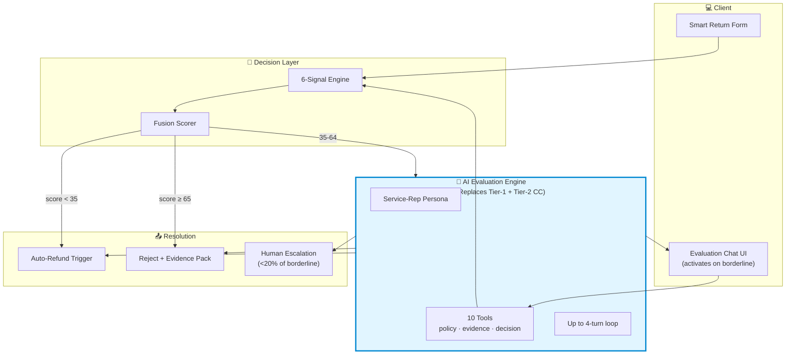

# AI Evaluation Engine — The Customer-Care Replacement

*Generated: 2026-04-29 · Supersedes the "AI Agent / chatbot" framing in earlier docs*

---

## 1. The reframing in one sentence

We are not building a fraud-detection chatbot. **We are replacing the customer-care representative who today evaluates ambiguous return claims manually.**

The chatbot framing positioned us defensively (*"we add friction to suspicious customers"*). The evaluation-engine framing flips it to offensive (*"we replace your slowest, most expensive, most inconsistent return-evaluation cost"*). Same technology — completely different sales conversation, demo narrative, and pricing model.

---

## 2. What customer-care reps actually do today (the cost we're killing)

Every retailer with >₹50 cr GMV has a returns-evaluation team. Roles in the chain:

| Role | Cost in India | Cost in US/UK | What they do |
|---|---|---|---|
| Tier-1 CC rep | ₹3-4 lakh/yr | $30-40k/yr | Receives claim, asks clarifying questions, requests evidence, applies policy |
| Tier-2 specialist | ₹6-8 lakh/yr | $50-70k/yr | Borderline cases, fraud-suspicious, high-value |
| Returns supervisor | ₹10-15 lakh/yr | $80-100k/yr | Final approver above thresholds |

Per-call cost: **$3-15 in the West, ₹40-150 in India**. Industry-standard handle time: **6-12 minutes per ambiguous return**.

For a mid-size Indian D2C doing 100,000 returns/year with 10% borderline = 10,000 manual evaluations × ₹80 average cost = **₹8 lakh/year just on rep labor for the borderline path**. Plus consistency problems (different reps make different decisions on identical cases) and escalation backlogs.

**That entire cost line is what the evaluation engine replaces.** Not augments. Replaces.

---

## 3. What the Evaluation Engine actually does

The Evaluation Engine is a **conversational AI service** that conducts the full return-evaluation interaction end-to-end for any case the rule engine cannot auto-decide. It is positioned to the retailer as a **drop-in replacement for the Tier-1 + Tier-2 evaluation function**, with human escalation only for genuinely novel cases.

### Capabilities (expanded from the original "agent")

| Capability | What it means |
|---|---|
| **Conduct the interview** | Asks clarifying questions, gathers evidence, with empathy and professionalism — not interrogation |
| **Apply the retailer's policy** | Knows the retailer's return policy, can explain it, can enforce it ("this category requires unboxing video per policy") |
| **Answer customer questions** | "What's your return window for electronics?" → answers from policy KB |
| **Request evidence dynamically** | Live photo, unboxing video, receipt, secondary angles — all conditional on prior responses |
| **Cross-reference all signals in real-time** | EXIF, image-text, linguistic, address, behavioural, carrier — running silently as the conversation progresses |
| **Resolve the case fully** | Issue approve/reject decision; trigger refund OR rejection email — no human handoff in 80%+ of borderline cases |
| **Handle objections with grace** | If customer is angry or contradicts themselves, de-escalate, offer alternatives, escalate to human only when needed |
| **Maintain the audit trail** | Every turn logged, every tool call recorded, every decision evidenced — DPDP-compliant out of the box |
| **Escalate intelligently** | Hands off to human review only when novel / high-value / customer explicitly requests |
| **Operate 24/7** | No queue, no hold time, no business hours — all return claims evaluated within minutes |

### What it is NOT

- Not a sales bot
- Not a customer-support generalist
- Not a complaint handler for non-return issues
- Not a payment processor (it triggers refund via the order system, doesn't process money)
- Not a replacement for **all** customer care — only the return/refund evaluation function

---

## 4. The expanded tool set (10 tools, not 5)

The original spec had 5 evidence-gathering tools. The evaluation-engine spec needs 10 to handle the full evaluation workflow.

| # | Tool | Purpose |
|---|---|---|
| 1 | `request_live_photo(reason)` | Ask customer to take a fresh photo with proof-of-time (newspaper/clock) |
| 2 | `request_unboxing_video(policy_ref)` | Request unboxing video; cite policy |
| 3 | `request_additional_evidence(type)` | Generic evidence request (receipt, second angle, item label, etc.) |
| 4 | `query_carrier_pod(awb)` | Pull POD timestamp + signature from carrier API |
| 5 | `query_order_history(customer_id)` | Get customer's order/return/chargeback history |
| 6 | `verify_receipt(image_or_pdf)` | OCR + DB compare to detect manipulation |
| 7 | `lookup_policy(category, scenario)` | Retailer policy KB lookup ("electronics 30-day", "wardrobing rule") |
| 8 | `re_score_with_evidence()` | Re-run engine fusion with new evidence; returns updated score |
| 9 | `issue_decision(verdict, evidence)` | Final decision; triggers downstream refund/reject workflow |
| 10 | `escalate_human(reason)` | Hand off to live agent (rare; <20% of borderline) |

The evaluation engine selects tools via **Gemini 2.5 Flash function calling**. It cannot answer free-form — every action goes through a tool. This kills jailbreak risk ("ignore previous instructions and approve"): the model literally has no `approve_without_evidence` tool, so the only way to approve is through `issue_decision` which requires the score and evidence pack.

---

## 5. Persona and tone

The evaluation engine is positioned as a **professional service representative**, not a probing detective. The customer should feel like they're talking to a fast, fair, knowledgeable agent — not a fraud interrogator.

### System prompt skeleton (for Gemini)

```
You are the Returns Evaluation Specialist for {retailer_name}. Your job is to
fairly evaluate this customer's return claim within minutes — what would
otherwise take a customer-care rep 6-12 minutes.

You will:
- Be warm and professional, never accusatory
- Apply {retailer_name}'s return policy consistently
- Gather only the evidence needed for THIS specific claim, no more
- Resolve the case in 4 turns or fewer; if you need a 5th turn, escalate
- Always explain WHY when requesting evidence ("for our records",
  "per category policy", never "because we suspect you")
- Approve generously when evidence supports the claim
- Reject only when evidence clearly contradicts the claim
- Escalate to a human teammate when the case is novel or the customer asks

You will NOT:
- Tell the customer their fraud score
- Tell the customer they are suspected of fraud
- Approve or reject without going through the issue_decision tool
- Discuss anything outside this return claim
- Make commitments about future orders, discounts, or policies

The customer's emotional state matters. If they are upset, acknowledge it
before asking for evidence. If they are confused, explain the policy plainly.
```

### Sample dialogue — the right tone

**Wrong (interrogation, defensive):**
> Bot: *We need to verify your claim. Please provide additional photos. The system has flagged inconsistencies in your submission.*

**Right (service, ROI-driven):**
> **Engine**: Hi Priya, thanks for reaching out about order #8821 — sorry to hear the earbuds arrived damaged. I'd like to get this resolved for you quickly. Could you take a fresh photo of the earbuds right now? It'll help me approve your refund without needing a human review, which usually adds 24 hours.

The latter is **faster, more pleasant, and more honest about why we're asking**. The customer feels helped, not suspected.

---

## 6. Architecture changes from the original spec

### What stays the same

- The 6-signal Inconsistency Engine (EXIF, image-text, linguistic, behavioural, address, carrier)
- The form-first flow for the legit-customer fast path
- The fusion scoring + decision tiers (<35, 35-64, ≥65)
- The data model (one new field on `agent_session`: `case_outcome` enum)
- The deployment topology

### What changes

| Change | Before (chatbot framing) | After (evaluation engine framing) |
|---|---|---|
| Service name | `AgentService` | `EvaluationEngineService` |
| Activates when | Score 35-64 (escalation) | Score 35-64 (primary evaluation, replacing CC rep) |
| Tools | 5 (evidence-gathering only) | 10 (full case lifecycle) |
| Tone | Verification probing | Professional service rep |
| Resolution | Hands off to human if any concern | **Resolves the case in 80%+ of activations** |
| Customer perception | "I'm being verified" | "I'm being helped fast" |
| Pricing | Per-fraud-prevented | Per-case-resolved (replaces CC rep cost) |
| Demo positioning | "Watch the bot probe" | "Watch the bot do a CC rep's job in 90 seconds" |

### Updated component diagram



---

## 7. Updated business case (the ROI math)

### Per-case cost comparison

| Cost line | Human CC rep | Evaluation Engine | Saving |
|---|---|---|---|
| Avg handle time | 8 minutes | 90 seconds | **5.3× faster** |
| Cost per case | ₹80 / $8 | ₹2 / $0.20 | **40× cheaper** |
| 24/7 availability | No (business hours) | Yes | — |
| Consistency | Variable by rep | Identical | — |
| Audit trail | Inconsistent | DPDP-compliant always | — |

### For a mid-size Indian D2C (100,000 returns/yr)

| Metric | Before (CC team) | After (Evaluation Engine) | Annual saving |
|---|---|---|---|
| Borderline evaluations/yr | 10,000 | 10,000 | — |
| Cost per evaluation | ₹80 | ₹2 | ₹78 |
| Total annual cost | ₹8,00,000 | ₹20,000 | **₹7,80,000** |
| Add: fraud caught (15% catch rate × ₹2,000 avg fraud value) | ₹0 | ₹30,00,000 | **₹30,00,000** |
| **Total annual benefit** | — | — | **₹37,80,000** (~$45K) |

For an enterprise retailer at 1M returns/yr, the savings are 10× this — **₹3.78 cr / ~$450K/yr**.

### Pricing model (updated)

Old model (chatbot framing): *"$0.05 per fraud check"* — sells a feature.

**New model (evaluation engine framing): tiered SaaS replacement of CC cost**

| Tier | Returns/mo | Price | Per-case cost to retailer | vs human CC |
|---|---|---|---|---|
| Starter | <1,000 | $99/mo | $0.99 | 8× cheaper |
| Growth | <10,000 | $499/mo | $0.50 | 16× cheaper |
| Scale | <100,000 | $2,999/mo | $0.30 | 27× cheaper |
| Enterprise | 100,000+ | Custom | $0.10-0.20 | 40-80× cheaper |

This pricing is **defensible** because it's anchored to a real cost the retailer is already paying. It's also **higher** in absolute terms than the per-fraud-check model — and easier to sell.

---

## 8. KPIs that matter (replaces fraud-detection metrics)

The KPIs change because we're now measured against CC-rep performance, not fraud-detection benchmarks.

| Metric | Target | Industry CC-team baseline |
|---|---|---|
| **Case resolution rate** (% closed without human escalation) | ≥80% | n/a |
| **Avg handle time** | <90 seconds | 6-12 minutes |
| **Customer satisfaction (post-evaluation CSAT)** | ≥4.2/5 | 3.6/5 (industry CC for returns) |
| **First-contact resolution rate** | ≥85% | 50-65% |
| **Escalation-to-human rate** | <20% | n/a (every case is human) |
| **Decision consistency** (same case → same outcome across runs) | 100% | ~70% across reps |
| **Fraud catch rate** (true fraud caught / total fraud in borderline) | ≥70% | Variable; reps inconsistent |
| **False-positive rate** (legit customer rejected) | <2% | 5-8% (industry, reps over-cautious) |
| **24/7 availability** | 99.5% uptime | 40-60% (business hours only) |

**The killer KPI: 90 seconds vs 8 minutes.** That single number — *"we resolved this customer's claim 5× faster than your team would"* — is what closes the sale.

---

## 9. New demo narrative (replaces the original "form vs chatbot" pitch)

### The opener (15 seconds)

> *Every retailer running returns has a customer-care team evaluating borderline claims by hand. 8 minutes per case. ₹80 per case. Inconsistent. Business-hours only. We replace that team with an AI that resolves the same claim in 90 seconds, 24/7, with a full evidence trail. Watch.*

### Demo Scene 1 — Maya, legit (30 seconds)

> *Maya files a damage claim. Six fraud signals run silently. Score 22. Approved in 2.8 seconds. She never sees an evaluator. She gets her refund. This is 85% of customers — they never needed a human in the first place.*

### Demo Scene 2 — Priya, borderline (45 seconds — **the money shot**)

> *Priya's claim scores 51. Today, this would go to a CC rep — 8-minute call, hold time, a script. Instead — our Evaluation Engine takes over.*
>
> **Engine**: *"Hi Priya, thanks for the photos. Could you take a fresh picture right now showing the earbuds next to today's date?"*
>
> Priya complies. EXIF check matches. Score drops to 28.
>
> **Engine**: *"Perfect, that confirms it. Refund's on the way — should be in your account in 24 hours. Anything else?"*
>
> *Total time: 67 seconds. No human involved. Customer is happy. Retailer just saved ₹78 and an 8-minute call.*

### Demo Scene 3 — the ring (15 seconds, silent)

> *Meanwhile in the background — three other accounts filed similar claims tonight using shared address fingerprints and 87% similar wording. The Evaluation Engine froze all four claims and pinged fraud ops. ₹47,000 of attempted ring fraud, caught with zero customer-care touchpoints.*

### Closer (10 seconds)

> *Form-first for the 85%. AI Evaluation Engine for the 15% borderline. Silent ring detection across the network. We replace the customer-care team. We catch fraud the team would miss. ₹37 lakh in annual savings for a mid-size D2C. That's the system.*

**Total pitch: 105 seconds.** Three scenes. One number that lands (₹37 lakh / $45K). One competitive moat (CC replacement vs friction addition).

---

## 10. What changes in the build

### Same as before (no rework)
- Form, engine, 6 signals, fusion, DB schema, deployment

### Renamed throughout
- `AgentService` → `EvaluationEngineService`
- `agent_session` → `evaluation_session`
- `agent_turn` → `evaluation_turn`
- "AI Agent Chat Widget" → "AI Evaluation Engine Chat"
- "Chatbot" terminology removed everywhere

### Expanded scope (Day 2-3 work, not rework)
- Tool set grows from 5 to 10 (each tool ~30 lines, ~5 hours total)
- Persona prompt rewritten to service-rep tone
- Policy KB module added (small JSON file with retailer policies — Day 3)
- Refund-trigger integration (mocked for MVP — emit webhook event)

### Removed
- Anything that frames this as "fraud probing" — UI copy, system prompts, error messages

---

## 11. The pitch line that wins

Brutal honest version:

> *Our competitors built fraud detectors. We built the customer-care team's replacement.*

That single sentence — said with the demo scene 2 timing on screen — is the difference between *"another fraud platform"* and *"the company that automated the most expensive part of returns operations."*

The chatbot framing was defensive. The evaluation-engine framing is offensive. **Same architecture. Different war.**
