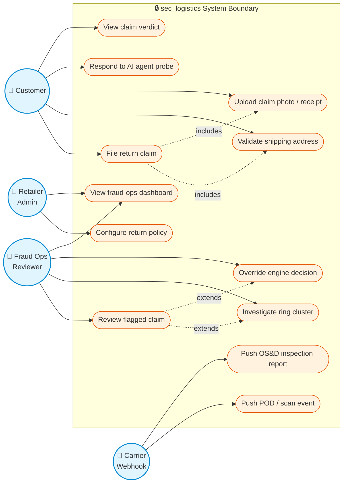
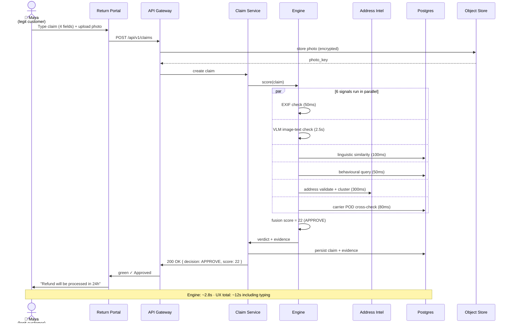
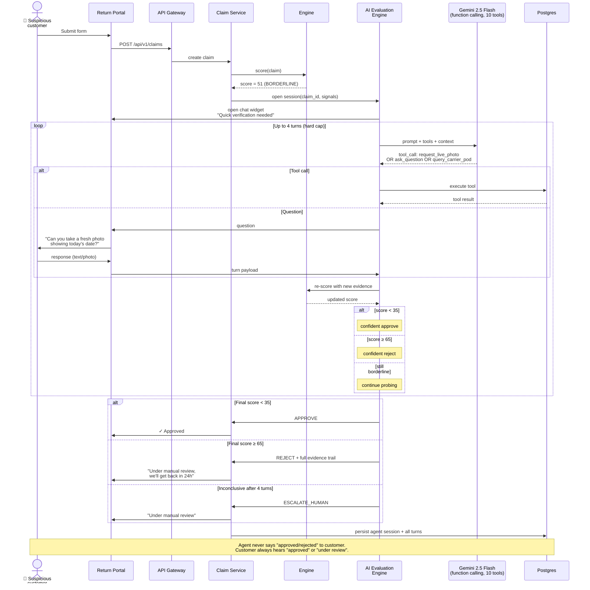
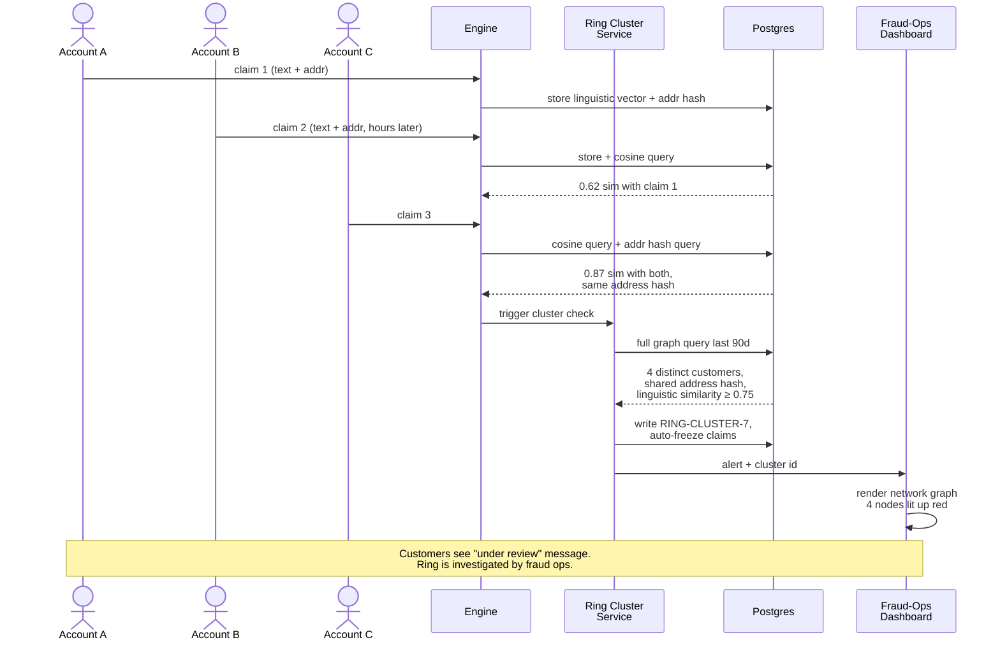
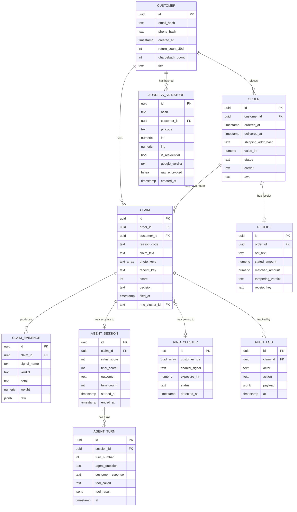
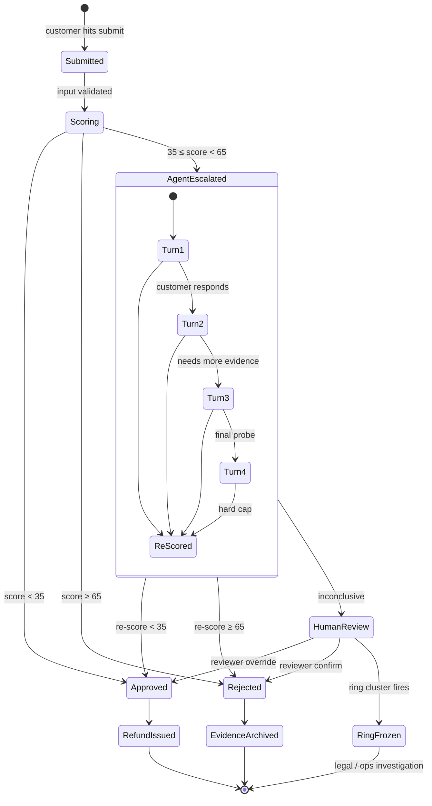
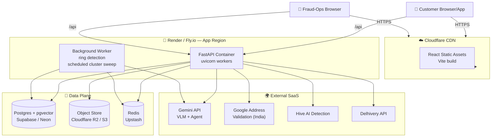
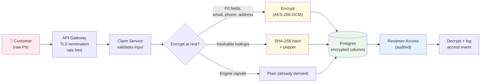

# sec_logistics — System Design

*Generated: 2026-04-29 · Companion to [MARKET_RESEARCH.md](MARKET_RESEARCH.md), [EXCEPTION_FRAMING.md](EXCEPTION_FRAMING.md), [ADDRESS_VALIDATION.md](ADDRESS_VALIDATION.md), [EVALUATION_ENGINE.md](EVALUATION_ENGINE.md)*

> **Naming note (2026-04-29):** What was originally drafted as "AI Agent" / "chatbot" has been **repositioned as the AI Evaluation Engine** — a customer-care-rep replacement, not a customer-friction layer. See [EVALUATION_ENGINE.md](EVALUATION_ENGINE.md) for the full reframing. References to "AI Agent" below should be read as "AI Evaluation Engine".

This document is the single canonical reference for the build. It contains:

1. Use-case (UML) diagram
2. High-level component architecture
3. Sequence diagrams for the three customer paths
4. Database ER diagram
5. State machine — claim lifecycle
6. Deployment topology
7. API surface
8. Tech stack
9. Folder structure
10. DPDP / security boundaries

All diagrams are Mermaid — they render natively in GitHub, GitLab, VS Code (with Mermaid extension), Notion, Obsidian, and any modern markdown viewer.

---

## 1. Use-Case Diagram (UML)

The system has four primary actors: the **Customer**, the **Fraud Ops Reviewer**, the **Retailer Admin**, and the **Carrier System** (webhook-driven). The AI Agent is a sub-actor inside the system boundary that intermediates between Customer and the engine on borderline cases.



---

## 2. High-Level Component Architecture

This is the system at the level of services and external dependencies. Each box is a deployable unit or an external SaaS.

```mermaid
flowchart TB
    subgraph Client["💻 Client Layer"]
        UI["Customer Return Portal<br/>React + Vite"]
        AdminUI["Fraud-Ops Dashboard<br/>React + Vite"]
        ChatUI["AI Evaluation Engine UI<br/>React Component"]
    end

    subgraph Edge["🌐 Edge / API Gateway"]
        APIGW["FastAPI Gateway<br/>Auth · Rate Limit · CORS"]
    end

    subgraph Services["⚙️ Backend Services"]
        ClaimSvc["Claim Service"]
        AgentSvc["Evaluation Engine Service<br/>Gemini Function Calling<br/>(replaces CC rep)"]
        AddrSvc["Address Intelligence"]
        CarrierSvc["Carrier Signal Adapter"]
        AuditSvc["Audit & Evidence Vault"]
        RingSvc["Ring Cluster Service<br/>background worker"]
    end

    subgraph Engine["🧠 Inconsistency Engine — 6 Signals"]
        EXIF["EXIF Forensics"]
        IMG["Image-Text VLM"]
        LING["Linguistic Fingerprint"]
        BEH["Behavioural Scorer"]
        ADDR["Address Cluster"]
        CAR["Carrier Cross-check"]
        FUS["Fusion Scorer"]
    end

    subgraph Data["💾 Data Layer"]
        PG[("Postgres + pgvector<br/>relational + embeddings")]
        OBJ[("Object Store<br/>S3 / Cloudflare R2")]
        CACHE[("Redis<br/>session + rate limit")]
    end

    subgraph External["🌍 External APIs"]
        Gemini["Gemini 2.5 Flash<br/>VLM + Agent"]
        GAV["Google Address Validation<br/>India ML model"]
        Delh["Delhivery / Bluedart<br/>Serviceability + POD"]
        Hive["Hive AI<br/>AI-image detection"]
        Carrier_API["Carrier Webhook In<br/>POD · Scan · OS&D"]
    end

    UI --> APIGW
    AdminUI --> APIGW
    ChatUI --> APIGW
    Carrier_API --> APIGW

    APIGW --> ClaimSvc
    APIGW --> AgentSvc
    APIGW --> AddrSvc
    APIGW --> CarrierSvc

    ClaimSvc --> Engine
    EXIF --> FUS
    IMG --> FUS
    LING --> FUS
    BEH --> FUS
    ADDR --> FUS
    CAR --> FUS

    AgentSvc --> Gemini
    IMG --> Gemini
    IMG --> Hive
    AddrSvc --> GAV
    AddrSvc --> Delh
    CarrierSvc --> Delh
    CAR --> CarrierSvc
    ADDR --> AddrSvc

    ClaimSvc --> PG
    Engine --> PG
    Engine --> CACHE
    AddrSvc --> PG
    AuditSvc --> PG
    AuditSvc --> OBJ
    ClaimSvc --> OBJ
    AgentSvc --> CACHE
    RingSvc --> PG

    classDef ext fill:#fce4ec,stroke:#ad1457
    classDef data fill:#e8f5e9,stroke:#2e7d32
    classDef svc fill:#fff8e1,stroke:#f57f17
    class Gemini,GAV,Delh,Hive,Carrier_API ext
    class PG,OBJ,CACHE data
    class ClaimSvc,AgentSvc,AddrSvc,CarrierSvc,AuditSvc,RingSvc svc
```



---

## 3. Sequence Diagrams — The Three Customer Paths

### 3.1 Legitimate Path — Maya (target: <3 sec engine time, ~12 sec end-to-end)

The 85-95% case. No chatbot. No friction. Maya never sees the engine.



### 3.2 Borderline Path — AI Evaluation Engine takes over (5-15% of cases)

Score lands 35-64. **What today goes to a customer-care rep** instead goes to the AI Evaluation Engine. 10 tools, 4-turn cap, professional service-rep tone. Resolves 80%+ of cases without human involvement.



### 3.3 Ring Detection — silent backend catch

Cluster fires across multiple unrelated claims. Customers never see this — they see "under review."



---

## 4. Database — ER Diagram

The schema is intentionally narrow at MVP: 9 core tables. Designed for DPDP compliance (encrypted PII, hashed lookups, audit trail).



### Key DB design decisions

| Decision | Rationale |
|---|---|
| Hash email/phone/address | DPDP minimisation; cluster lookup works on hash |
| `bytea raw_encrypted` for raw address | Encrypted-at-rest; only decrypted on reviewer access (audit trail) |
| `pgvector` extension on `claim_text` embedding | Linguistic similarity at scale; works at 100k+ claims |
| `ring_cluster_id` as soft FK | Claims can join a cluster after the fact; nullable |
| `audit_log` immutable | Append-only; legal artefact for India CPA-2019 / Carmack disputes |
| `claim_evidence` separate from claim | Evidence is the "show your work" trail; queryable, exportable |
| All timestamps UTC | Cross-timezone audit consistency |

---

## 5. State Machine — Claim Lifecycle

Every claim moves through this finite state machine. Auditable transitions.



---

## 6. Deployment Architecture

Hackathon-friendly stack: free tiers cover everything for the demo, scales to production with the same code.



### Free-tier cost (hackathon scale, ≤1000 ops/day)

| Component | Free tier | After free tier |
|---|---|---|
| Render / Fly.io | 750 hrs/mo free | $7/mo Hobby |
| Supabase / Neon | 500 MB DB free | $25/mo Pro |
| Cloudflare R2 | 10 GB free | $0.015/GB |
| Upstash Redis | 10,000 cmds/day free | pay per cmd |
| Gemini API | $200 credit | $0.30/$2.50 per M tok |
| Google Address Validation | $200 credit (≈11.7K calls) | $0.017/call |
| Hive AI Detection | trial credits | volume-based |
| **Total hackathon** | **$0** | ~**$50/mo at SMB scale** |

---

## 7. API Surface

### Customer-facing

| Method | Path | Purpose |
|---|---|---|
| POST | `/api/v1/claims` | Submit return claim (form path) |
| GET | `/api/v1/claims/{id}` | Get claim status |
| POST | `/api/v1/evaluation/{session_id}/turn` | Customer responds to evaluation engine |
| POST | `/api/v1/address/validate` | Pre-flight address validation |
| POST | `/api/v1/upload/photo` | Upload claim photo (presigned) |
| POST | `/api/v1/upload/receipt` | Upload receipt (presigned) |

### Fraud-ops dashboard

| Method | Path | Purpose |
|---|---|---|
| GET | `/api/v1/admin/queue` | List flagged claims |
| GET | `/api/v1/admin/claims/{id}/evidence` | Full evidence trail |
| POST | `/api/v1/admin/claims/{id}/override` | Reviewer override decision |
| GET | `/api/v1/admin/rings` | List ring clusters |
| GET | `/api/v1/admin/rings/{id}` | Ring drill-down |

### Webhooks (carrier inbound)

| Method | Path | Purpose |
|---|---|---|
| POST | `/api/v1/webhooks/carrier/pod` | Proof-of-delivery event |
| POST | `/api/v1/webhooks/carrier/scan` | Scan trail event |
| POST | `/api/v1/webhooks/carrier/osd` | OS&D inspection report |

### Response envelope (every endpoint)

```json
{
  "ok": true,
  "data": { ... },
  "error": null,
  "meta": {
    "request_id": "req_8821",
    "timing_ms": 412
  }
}
```

---

## 8. Tech Stack

| Layer | Choice | Why |
|---|---|---|
| Frontend | React 18 + Vite + TailwindCSS | Fast dev loop; demo polish |
| State | Zustand or React Query | No Redux ceremony |
| Backend | Python 3.12 + FastAPI | Fastest path for ML + API |
| Async | asyncio + httpx | Parallel signal execution |
| ML | scikit-learn, sentence-transformers | TF-IDF + embeddings for linguistic |
| VLM | google-generativeai (Gemini) | Best price/perf in 2026 |
| Image forensics | Pillow, exifread, ImageHash | Open source; zero cost |
| OCR | Gemini vision + tesseract fallback | Receipt parsing |
| DB | Postgres 16 + pgvector | Relational + vector in one |
| Object store | Cloudflare R2 (S3-compat) | Egress-free |
| Cache | Redis (Upstash) | Session + rate limit |
| Hosting | Render / Fly.io | Free tier; one-click deploy |
| CDN | Cloudflare | Free; SSL included |
| Monitoring | Sentry (frontend + backend) | Free tier sufficient |
| Auth (admin) | Clerk or Supabase Auth | Skip rolling our own |

---

## 9. Folder Structure

```
sec_logistics/
├── docs/                       # all the research + design docs
├── server/
│   ├── app/
│   │   ├── main.py             # FastAPI entry
│   │   ├── config.py           # env settings (pydantic-settings)
│   │   ├── deps.py             # DI for DB, Redis, etc.
│   │   ├── routers/
│   │   │   ├── claims.py
│   │   │   ├── agent.py
│   │   │   ├── address.py
│   │   │   ├── admin.py
│   │   │   └── webhooks.py
│   │   ├── services/
│   │   │   ├── claim_service.py
│   │   │   ├── agent_service.py
│   │   │   ├── address_intel.py
│   │   │   ├── carrier_signals.py
│   │   │   ├── audit.py
│   │   │   └── ring_cluster.py
│   │   ├── engine/
│   │   │   ├── exif.py         # signal 1
│   │   │   ├── image_text.py   # signal 2
│   │   │   ├── linguistic.py   # signal 3
│   │   │   ├── behavioural.py  # signal 4
│   │   │   ├── address.py      # signal 5
│   │   │   ├── carrier.py      # signal 6
│   │   │   └── fusion.py       # weighted aggregation
│   │   ├── evaluation_engine/
│   │   │   ├── tools.py        # 10 tools (CC-rep replacement scope)
│   │   │   ├── prompts.py      # service-rep persona prompt
│   │   │   ├── policy_kb.py    # retailer policy lookup
│   │   │   └── runner.py       # Gemini function-calling loop
│   │   ├── db/
│   │   │   ├── models.py       # SQLAlchemy
│   │   │   ├── crud.py
│   │   │   └── migrations/     # Alembic
│   │   ├── schemas/            # Pydantic request/response
│   │   └── utils/
│   │       ├── crypto.py       # encrypt-at-rest, hashing
│   │       └── timing.py
│   ├── tests/
│   │   ├── unit/
│   │   ├── integration/
│   │   └── fixtures/
│   │       ├── seed_legit.py
│   │       ├── seed_borderline.py
│   │       └── seed_ring.py    # the 4-account ring
│   ├── pyproject.toml
│   └── Dockerfile
├── client/
│   ├── src/
│   │   ├── pages/
│   │   │   ├── ReturnForm.tsx
│   │   │   ├── ClaimStatus.tsx
│   │   │   └── AdminDashboard.tsx
│   │   ├── components/
│   │   │   ├── EvaluationChat.tsx
│   │   │   ├── EvidenceTrail.tsx
│   │   │   ├── RingGraph.tsx
│   │   │   └── ThresholdSlider.tsx
│   │   ├── lib/
│   │   │   ├── api.ts
│   │   │   └── store.ts
│   │   └── App.tsx
│   ├── package.json
│   └── vite.config.ts
├── infra/
│   ├── docker-compose.yml      # local dev: pg + redis + minio
│   └── render.yaml             # Render deploy
├── scripts/
│   ├── seed_demo.py            # seed the demo dataset
│   └── reset_db.py
├── .env.example
├── README.md
└── .gitignore
```

---

## 10. DPDP / Security Boundaries

Highlighting where PII enters, transforms, and exits the system.



### Retention windows

| Data type | Retention | Reason |
|---|---|---|
| Claim photos | 9 months | Carmack window for carrier disputes |
| Claim text | 9 months | Same |
| Address signatures (hash only) | 90 days for cluster lookup; 1 year encrypted | DPDP §17 + cluster utility |
| Agent session transcripts | 1 year | DPDP minimum for fraud investigation |
| Audit log | 7 years | DPDP Large Data Fiduciary; legal artefact |
| Ring cluster records | indefinite (anonymised) | Fraud network intelligence |

---

## 11. How to Render These Diagrams as Images

You said you wanted images. Here are the four ways to get rendered output:

1. **Push to GitHub** → all Mermaid blocks render natively in the markdown viewer. Fastest.
2. **Open in VS Code** with the [Markdown Preview Mermaid Support](https://marketplace.visualstudio.com/items?itemName=bierner.markdown-mermaid) extension → renders in the preview pane.
3. **Mermaid Live Editor** → paste any block at https://mermaid.live, export as PNG/SVG. Use this for the pitch slides.
4. **CLI export** → install `@mermaid-js/mermaid-cli` and run `mmdc -i SYSTEM_DESIGN.md -o diagrams.pdf` for a single PDF with all diagrams.

For the hackathon pitch deck, recommended workflow:

```bash
npm install -g @mermaid-js/mermaid-cli
mmdc -i docs/SYSTEM_DESIGN.md -o docs/diagrams.pdf
# or per-diagram PNG:
mmdc -i docs/SYSTEM_DESIGN.md -o docs/diagrams.png -t dark -b transparent
```

---

## 12. Pitch Mapping — which diagram goes where

| Slide / moment | Diagram to use |
|---|---|
| Opening — "what is this system" | §2 Component Architecture |
| Demo Scene 1 (Maya legit) | §3.1 Sequence (legit path) |
| Demo Scene 2 (evaluation-engine resolves CC-rep case) | §3.2 Sequence (borderline) |
| Demo Scene 3 (ring catch) | §3.3 Sequence (ring detection) |
| "How is this defensible?" | §10 DPDP boundaries + §4 ER for evidence vault |
| "Can you scale this?" | §6 Deployment + cost table |
| "Why six signals" | §2 Component (zoom into Engine subgraph) |

---

*This design is intentionally narrow at MVP. Anything not in this document — vendor-specific integrations, advanced ML retraining loops, multi-tenant isolation, etc. — is post-MVP and should not be built in the 3-day window.*
